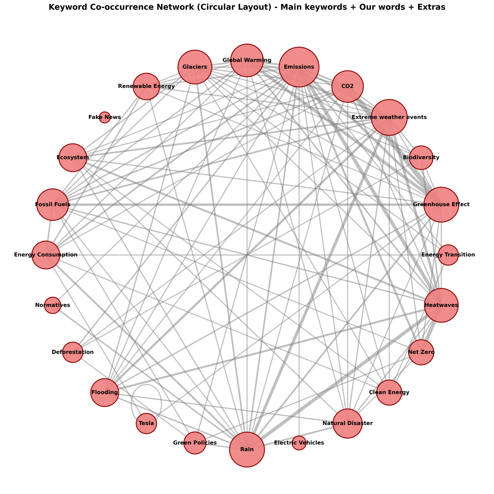
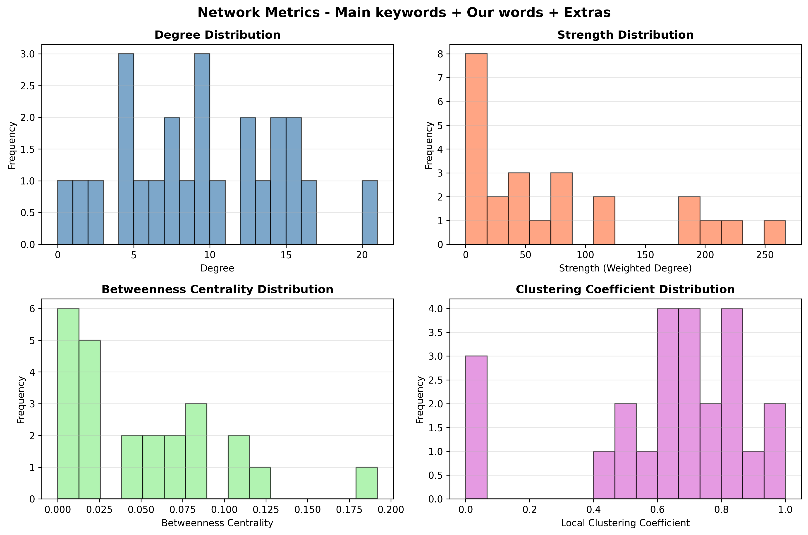

# NetworkLens

A command-line tool for constructing and analysing keyword co-occurrence networks from Bluesky post data, using methods from graph theory and complex network analysis.

 

## 1. Overview

Social media platforms constitute a high-volume source of unstructured textual data suitable for the empirical study of discourse, topic emergence, and information diffusion. NetworkLens addresses the problem of extracting structured relational information from such data by modelling keyword co-occurrence as a graph: nodes represent keywords, and edges represent their joint occurrence within a defined unit of text (e.g., a post).

This construction reduces the analysis of textual corpora to the analysis of network topology, permitting the application of established graph-theoretic measures — degree centrality, betweenness centrality, community structure — to questions that are otherwise addressed through purely qualitative or frequency-based text analysis. The intended audience is researchers, analysts, and practitioners investigating thematic clustering, narrative structure, or the spread of specific terminology in online text corpora.

## 2. Methodological Approach

The pipeline consists of four stages:

1. **Data acquisition** — Posts are retrieved from the Bluesky AT Protocol API, filtered by a configurable keyword set.
2. **Graph construction** — Co-occurrence relations between keywords are computed and represented as an undirected graph using NetworkX.
3. **Structural analysis** — Local (node-level) and global (graph-level) metrics are computed, and community detection is performed via the Louvain modularity-optimisation algorithm.
4. **Output generation** — Results are rendered as visualisations (spring and circular layouts, metric distributions, optional sentiment distributions) and exported in formats suitable for further analysis or archival.

### Analytical capabilities

- Semantic mapping of keyword associations via co-occurrence analysis, for the identification of emergent topics and narrative clusters.
- Quantitative characterisation of network structure through degree centrality, betweenness centrality, and community-membership statistics.
- Multi-mode analysis, supporting evaluation over the full keyword set, a restricted "main" subset, or extended thematic groupings.
- Deterministic, versioned run archiving: each execution is assigned a UUID-timestamped directory with accompanying metadata, supporting reproducibility of results.
- Export to CSV, GraphML (compatible with Gephi and Cytoscape), PNG, and XLSX adjacency-matrix formats.

## 3. Installation

### 3.1 Prerequisites

- Python ≥ 3.11 (required for dependency compatibility).
- A registered Bluesky account, for API authentication.

### 3.2 Containerised Deployment (recommended)

Containerised deployment is recommended for reproducibility, as it removes variation introduced by host-level dependency versions.

```bash
git clone https://github.com/francescosilvano/networklens.git
cd networklens
```

Create a `.env` file in the project root containing the following credentials:

```
BLUESKY_HANDLE=your.handle.bsky.social
BLUESKY_PASSWORD=your-password
```

Build and execute the container:

```bash
docker compose up --build
```

Output artefacts are written to `exports/`.

### 3.3 Local Installation

```bash
git clone https://github.com/francescosilvano/networklens.git
cd networklens
python -m venv venv
source venv/bin/activate    # Unix
venv\Scripts\activate       # Windows
pip install -e .            # or: pip install .
```

Populate `.env` with `BLUESKY_HANDLE` and `BLUESKY_PASSWORD` as above, then invoke the CLI:

```bash
networklens
```

## 4. Dependencies

Core dependencies are resolved automatically via pip and declared in `pyproject.toml`:

| Package | Function |
|---|---|
| `atproto` | Bluesky AT Protocol client, used for post retrieval |
| `networkx` | Graph construction and metric computation |
| `pandas` | Data manipulation and CSV export |
| `matplotlib` | Rendering of graphs and metric distributions |
| `textblob` | Sentiment analysis (optional) |
| `openpyxl` | Export of adjacency data to XLSX |
| `python-dotenv` | Environment-variable management |

Development dependencies (`pylint`, `pytest`, `build`) are installed via:

```bash
pip install networklens[dev]
```

## 5. Usage

Analysis parameters — keyword lists, fetch limits, and related configuration — are defined in `networklens/config.py`. Invoking the CLI executes the full pipeline: data collection, graph construction, and output generation, writing results to `exports/runs/<timestamp_uuid>/`.

The configuration supports variation in fetch period, keyword composition, and inclusion of sentiment analysis. Multiple configurations may be run in parallel for comparative analysis across parameter sets. Resulting GraphML files may be loaded into external network-analysis software for interactive exploration; CSV outputs support direct quantitative analysis of computed metrics.

## 6. Limitations

- The data source is currently restricted to Bluesky; extension to other platforms (e.g., X/Twitter) would require modification of the acquisition module.
- No multilingual support or advanced NLP methods (e.g., embedding-based semantic similarity) are implemented; keyword matching is used as the basis for co-occurrence.
- Parallel execution, compressed export formats, and searchable indexing of run history are not currently supported.

## 7. Provenance and Contributors

This project originated within the Complex Systems course at the University of Siena, academic year 2025/26. [Francesco Silvano](https://github.com/francescosilvano) is the primary author and maintainer. [Raphael](https://github.com/RaphaelNoah) contributed substantially to the refinement of the data-processing pipeline, improving the accuracy and reliability of computed results.

The work represents an application of concepts from complex systems theory to the empirical analysis of social media text.

## 8. License

Distributed under the MIT License. See `LICENSE` for full terms.
